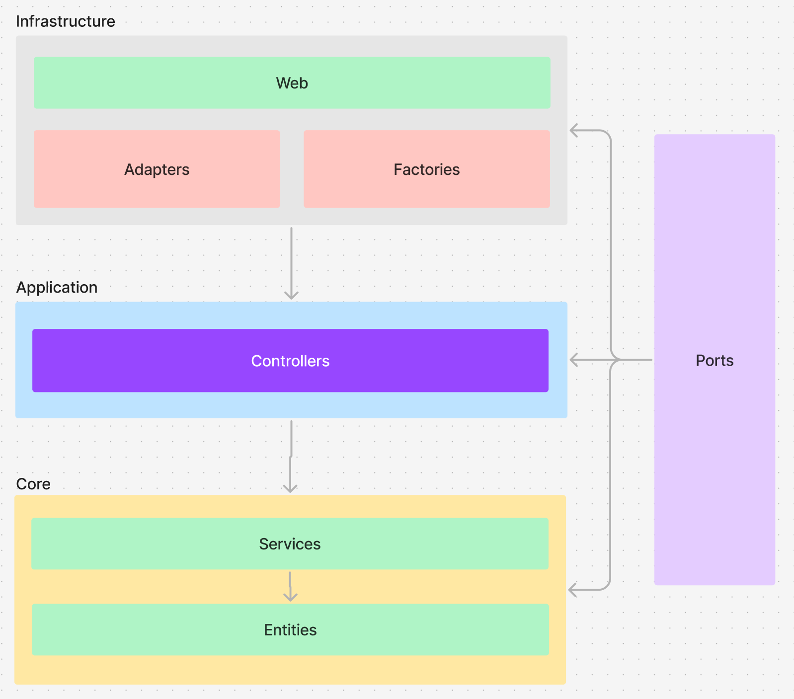

# Caju Code Challenge

## Detalhes do desenvolvimento

**TDD:** Utilizei o TDD pricipalmente no início do desenvolvimento para validar comportamentos do **Core** da aplicação.

**Refatorações:** Primeiro empreguei os conhecimentos base que tenho para desenvolver o código, após isso fui realizando refatorações principalmente para utilizar de conceitos da programação funcional
  - Eliminar o estado mutável de classes.
  - Usar funções puras que recebem todos os dados como parâmetros e retornam novos valores.
  - Aplicar métodos funcionais como map, reduce, filter.

**Regras de negócio:** O projeto foi totalmente pensado para isolar o máximo possível das regras de negócio, de estruturas comumente mais mutáveis, como qual será a ferramenta para capturar o input de dados.

**Orientação a Objetos e Programação Funcional:** Acho que a orientação a objetos misturado com conceitos de programação funcional pode ser bem útil, gosto muito de utilizar estruturas como classes e interfaces para definir padrões de design de código, e utilizar o conceito de imutabilidade para poder ter um código mais previsível e seguro.

**CI/CD:** Criei uma action no Github bem simples para rodar os testes unitários.

## Decisões de Técnologias

### Golang
A escolha de Golang foi motivada por diversas características que se alinham diretamente com as necessidades de um autorizador de pagamento:

- **Performance e Eficiência**: Golang é uma linguagem compilada que proporciona alto desempenho e consumo reduzido de recursos. Esse aspecto é crucial para um autorizador de pagamentos, onde a velocidade e a eficiência são fundamentais para processar transações de forma rápida.

- **Concorrência Nativa**: Com goroutines, o Golang oferece uma excelente capacidade de lidar com operações simultâneas, facilitando a criação de uma aplicação que pode processar várias requisições de autorização em paralelo (Não fiz o uso para não complexificar ainda mais o projeto).

- **Código Limpo e Simples**: A linguagem prioriza a simplicidade, permitindo um desenvolvimento mais ágil e menos propenso a bugs, o que é especialmente importante em aplicações críticas, como sistemas de pagamento.

- **Escalabilidade**: Projetado para suportar grandes demandas, o Golang permite escalar aplicações de forma eficiente, atendendo ao crescimento do volume de transações sem comprometer a estabilidade.

- **Tipagem Estática**: Gosto muito de linguágem de tipagem estática, pois o desenvolvimento torna-se mais seguro.

### MongoDB
MongoDB foi escolhido como banco de dados devido às suas vantagens para um sistema de pagamentos:

- **Modelo de Dados Flexível**: Como um banco de dados NoSQL, o MongoDB oferece flexibilidade no armazenamento de dados, sendo ideal para lidar com diferentes estruturas que possam surgir nas transações e nos dados de usuários.

- **Performance para Leitura e Escrita**: MongoDB oferece excelente desempenho em operações de leitura e escrita, possibilitando consultas rápidas e gravação ágil das transações, crucial para evitar latência no processo de autorização.

- **Controle de Concorrência com Lock Otimista**: MongoDB possui suporte ao controle de concorrência com lock otimista, o que é vantajoso em ambientes onde há alta concorrência nas operações de leitura e escrita, como em um autorizador de pagamentos. Esse recurso evita bloqueios de registro em operações simultâneas e permite que transações concorrentes possam ser gerenciadas sem sobrecarregar o sistema com locks rígidos, contribuindo para o desempenho e a integridade dos dados.

### Docker
Docker foi selecionado como ferramenta de containerização para simplificar o desenvolvimento e a operação do sistema de autorização de pagamento.

## Arquitetura e Design de código

Para arquitetar o código, me inspirei na **Arquitetura Hexagonal**, mas fiz o máximo para não criar camadas desnecessárias e manter o princípio da inversão de dependências fiel.



### Ports
Os ports são os contratos que orientam o design. Aqui temos as interfaces que são implementadas para que a execução da inversão de dependência seja feita e garanta a segurança das camadas mais internas da aplicação.

### Infrastructure

#### Web
A sub-camada web é o entrypoint da aplicação, onde é responsável por receber a comunicação de requisições HTTP, seguindo o padrão Rest.

#### Adapters
Os adapters são nesse contexto a implementação dos ports (contratos) para que a aplicação consiga insolar as camadas mais externas da lógica de negócio.

#### Factories
Aqui faço a centralização da criação de objetos com a construção mais complexa.

### Application

#### Controllers
Aqui faço o controle de fluxo entre **services**, e conversão de dados de entrada para as camadas mais internas da aplicação (**Core**).

### Core

#### Services
Possui regras de negócio e conduz fluxos de dados utilizando dos domínios.

#### Domais
Modelo de dados com validações específicas do domínio.

**Event Sourcing:** Me baseei em event sourcing na camada de persistência de dados, então todas as transação são criadas e imutáveis. Para validar se a pessoa possui crédito, é validado todo o histórico de transações **cashin** e **cashout**

## Requisitos

### Funcionais

| ID       | Descrição                                                                 |
|----------|---------------------------------------------------------------------------|
| RF-001   | O sistema deve receber transações via JSON contendo dados de conta, valor, mcc e comerciante |
| RF-002   | O sistema deve mapear o `mcc` para uma categoria de saldo específica (FOOD, MEAL ou CASH) |
| RF-003   | O sistema deve aprovar ou rejeitar a transação com base no saldo da categoria mapeada |
| RF-004   | Caso o saldo da categoria mapeada seja insuficiente, verificar saldo de `CASH` como fallback |
| RF-005   | Substituir `mcc` com base no nome do comerciante, quando houver inconsistência |
| RF-006   | Retornar um JSON com código `{ "code": "00" }` para transação aprovada    |
| RF-007   | Retornar um JSON com código `{ "code": "51" }` se saldo for insuficiente   |
| RF-008   | Retornar um JSON com código `{ "code": "07" }` para outros problemas de processamento |
| RF-009   | Garantir que transações simultâneas para a mesma conta sejam processadas de forma isolada |

### Não funcionais

| ID       | Descrição                                                                 |
|----------|---------------------------------------------------------------------------|
| RNF-001  | O sistema deve processar cada transação em menos de 100 ms                 |
| RNF-002  | O sistema deve ser escalável para lidar com picos de transações simultâneas |
| RNF-006  | O código deve ser modular e organizado para facilitar atualizações         |
| RNF-007  | O sistema deve conter um README com instruções claras de configuração e execução |
| RNF-008  | O sistema deve ter testes automatizados para validar comportamento em diferentes cenários de saldo e MCC |

## Rodar Aplicação

```zsh
docker-compose up
```

## Rodar Testes
A aplicação contém os testes de unidade, integração e e2e.
É possível rodar todos executanto o comando abaixo:

```zsh
sh test.sh
```

> É necessário ter o Docker e Docker Compose instalado.

### Teste manual via requisição HTTP

**Endpoint**: `/transactions`  
**Método**: `POST`  
**Descrição**: `É necessário primeiro fazer uma operação de cashin, para que as outras operações não sejam bloqueadas por falta de crédito`  

#### Headers
| Nome           | Valor              |
|----------------|--------------------|
| `Content-Type` | `application/json` |
| `Accept`       | `application/json` |

#### Corpo da Requisição - CASHIN
```json
{
	"account": "123",
	"totalAmount": 100.00,
	"mcc": "5811",
	"merchant": "PADARIA DO ZE               SAO PAULO BR",   
    "cashin": true
}
```

#### Corpo da Requisição - CASHOUT
```json
{
	"account": "123",
	"totalAmount": 100.00,
	"mcc": "5811",
	"merchant": "PADARIA DO ZE               SAO PAULO BR"
}
```

## Desafio L4 - Transações simultâneas
Esse problema pode ser resolvido de diferentes formas, colocando em uma **fila** e executando de forma sequêncial, mas como é citado no problema que essa operação necessáriamente é sincrôna, então podemos aplicar um **lock otimista ou pessimista**.

### Lock
O **lock pessimista** faz o bloqueio do recurso (linha, documento ou etc), isso vai impedir de que a execução de outras operações na linha sejam feitas, podendo descumprindo o critério da execução durar no máximo 100ms, então aplicar uma solução de **lock otimista** pode ser mais razoável.

### Event Sourcing
O Event Sourcing pode ajudar a resolver o problema de transações simultâneas ao armazenar todas as mudanças de estado como eventos imutáveis, permitindo que cada transação seja registrada de forma única. Ao implementar um mecanismo de controle de concorrência otimista, podemos verificar se o estado do cartão de crédito é consistente antes de processar uma nova transação. Se uma transação for iniciada enquanto outra está sendo processada, o sistema pode rejeitar ou enfileirar a nova transação, garantindo que apenas uma transação seja concluída por conta em um momento. Isso também permite auditoria e rastreamento de todas as transações realizadas, aumentando a segurança e a transparência. Além disso, o uso de filas de eventos pode ajudar a desacoplar o processamento, minimizando o tempo de resposta e evitando timeouts.